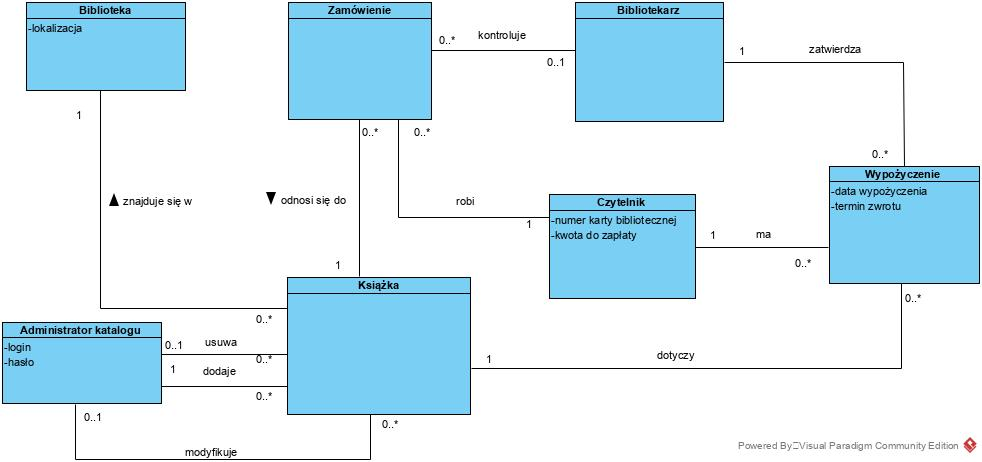
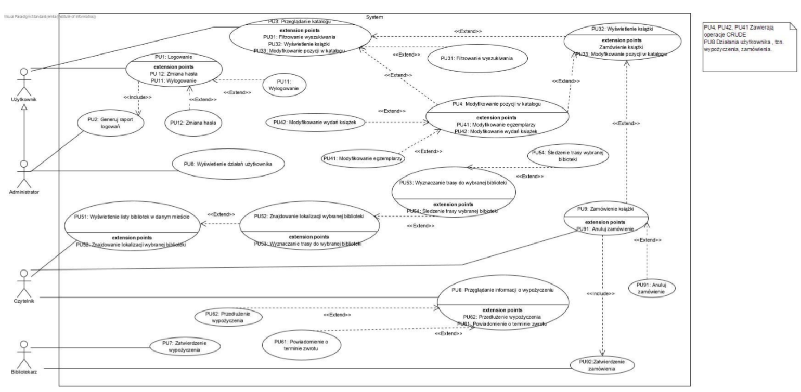
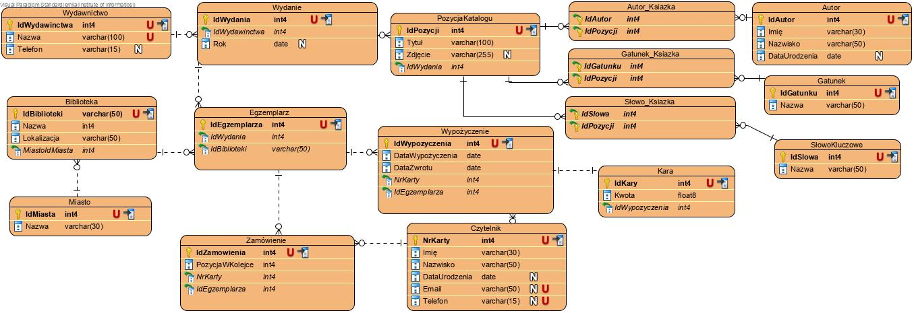
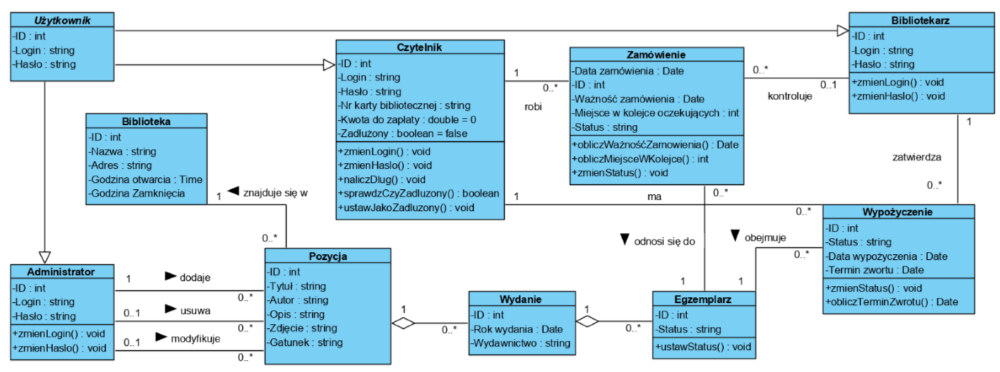
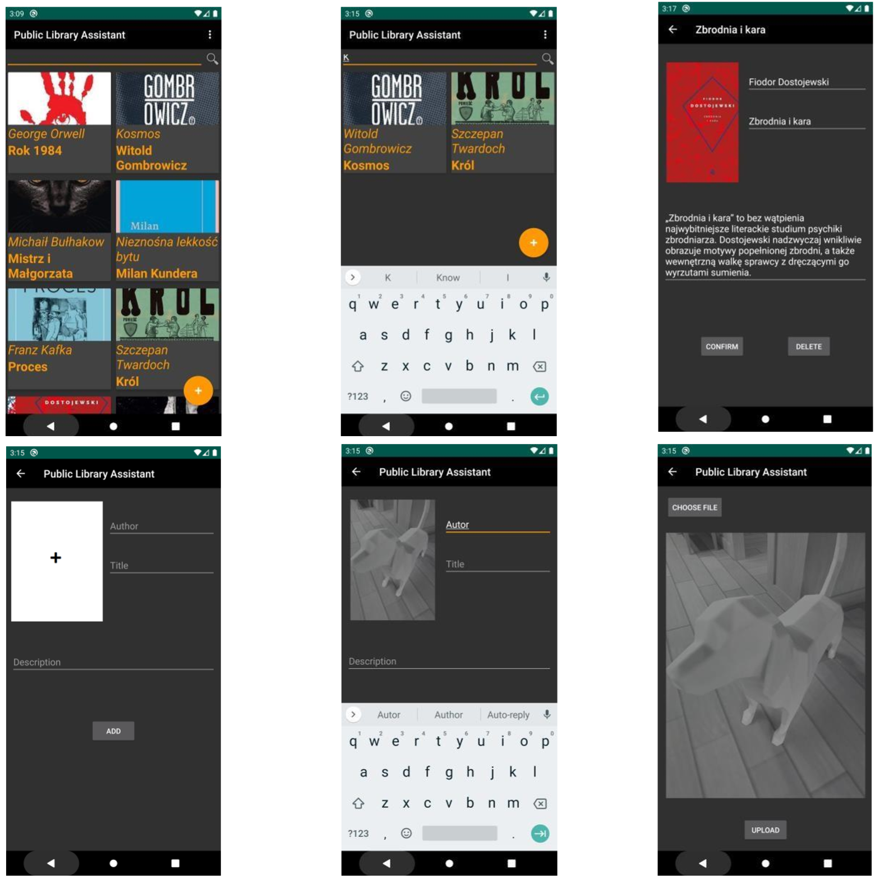

# LibraryApp
 
## Table of contents
* [Project Assumptions](#project-assumptions)
* [Domain Model](#domain-model)
* [Entity Relationship Diagram](#entity-diagram)
* [Class Diagram](#class-diagram)
* [GUI](#gui)

## Project Assumptions
The project concerns an application used to operate a public library catalog. The basic assumption is to develop a convenient system that allows browsing library catalogs. In addition, the application provides additional facilities in the form of notifications informing about the upcoming return dates of borrowed books or  system that locates library buildings. Thanks to a coherent system enabling cooperation with any public library in the Republic of Poland, the application will unify library catalogs and replace many completely different systems that are currently in use.

## Domain Model

## Use Case Diagram

## Entity Relationship Diagram

## Class Diagram

## Graphical User Interface

